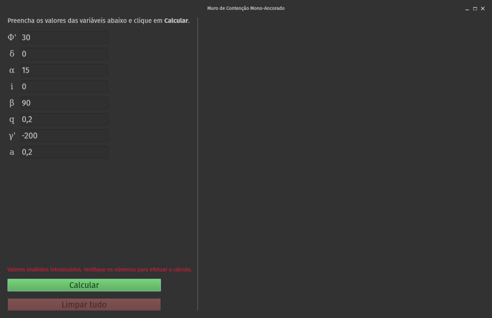

# MuroCalc

Ferramenta em Python para um engenheiro civil de Portugal para cálculos na construção
de [muros de arrimo](https://pt.wikipedia.org/wiki/Muro_de_arrimo) (também conhecidos
como muros de contenção), fornecendo valores e gráficos de pressões e forças
resultantes.

Precisei aprender rapidamente a configurar, utilizar e integrar scripts na linguagem
de programação GNU Octave, voltada à computação científica.

---

Aplicação da fórmula fornecida pelo cliente para ser implementada no programa:

Fluxo:

1. Inserir variáveis
2. Clicar em Calcular. Serão produzidos Fo (força resultante), Lu (comprimento útil
do cabo de ancoragem) e os gráficos relacionados:

Interface inicial:

Após clicar em Calcular:

Validação ao inserir dados inválidos (por exemplo, peso do solo `γ` negativo):

