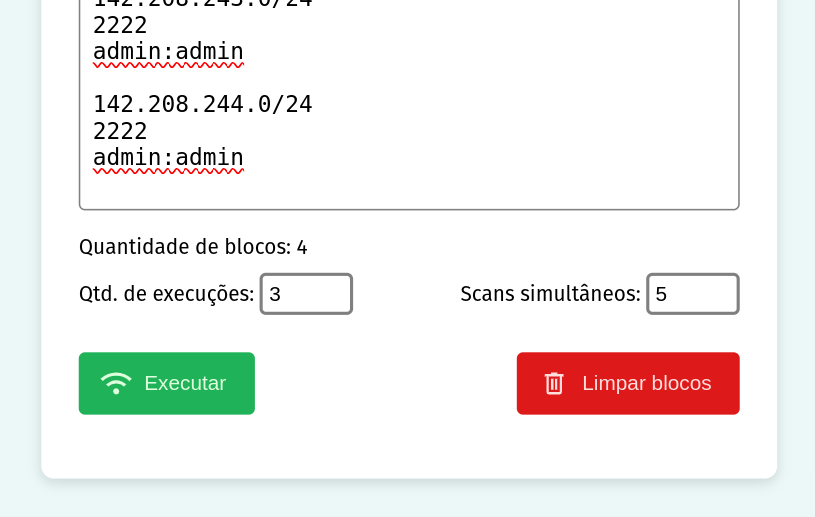

# RouterSuite

Ferramenta de automação de configuração de roteadores em Node.js + Python para técnicos
de telecomunicação.

Antes o cliente levava 30s para configurar cada roteador. Nossa automação configura um
roteador em 2s, elevando o rendimento de 120 para 1.800 dispositivos por hora.

---

Ferramenta de scan que o cliente nos pediu para automatizar:

Depois de escaneados, os scripts configuram cada roteador encontrado.

Modelos de roteadores trabalhados. Cada checkmark verde é um script customizado em
python. Checkmark azuis são roteadores que, por possuírem a mesma API, utilizam o
mesmo script.

Fluxo:

1. Colar blocos de roteadores a serem escaneados
2. Definir quantidade de loops (opcional), e de quantos blocos serão configurados
simultaneamente
3. Clicar em executar

Em execução:

Enviado pelo cliente, agradecendo (note a quantidade de blocos!):

