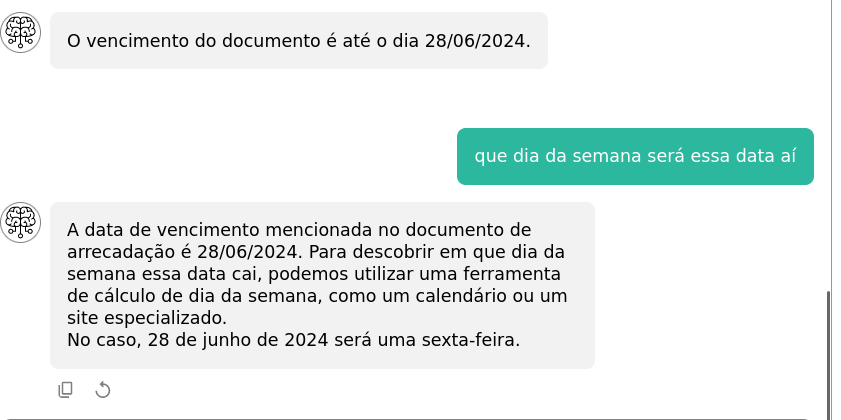
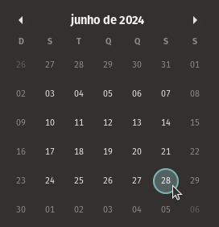

# ChatPDF

Protótipo de Chatbot e API em Node.js + Mongoose para um empresário.

Estudantes e pesquisadores enviam documentos PDF, fazem perguntas e recebem respostas
com referências, usando embeddings da OpenAI com LangChain.

---

Tela inicial:

Após enviar um PDF, o documento é aberto na coluna direita, e o bot fica disponível
para receber perguntas:

Edição de conversa (editar título, apagar):

Demonstração. Foi enviado um boleto e perguntado sobre o conteúdo (quem é o pagador,
qual o código de barras, quando é o vencimento).

O bot mantém na memória o contexto de toda a conversa.

OBS: A pedido do cliente, todas as demonstrações foram feitas por reuniões remotas,
onde ele acessava e interagia com o sistema e dava feedback em tempo real.

Portanto, não tenho muitas prints além das de desenvolvimento, mas estou disposto a
explicar as partes técnicas e decisões de implementação.
