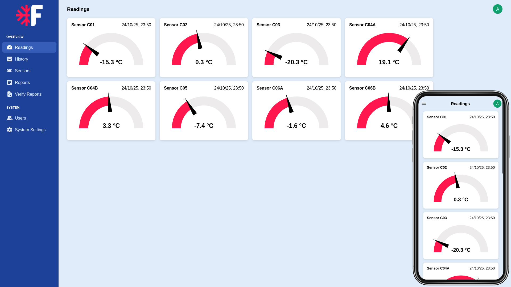

# FrostSense

Solução IoT em Flask+SQLAlchemy de monitoramento em tempo real da temperatura de
frigoríficos.

Para detalhes, código e documentação, visite o repositório do projeto:

https://github.com/purewave0/FrostSense/blob/main/README.pt-br.md
